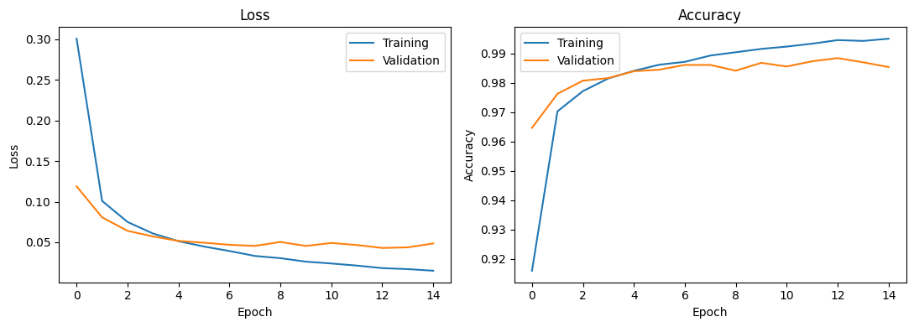
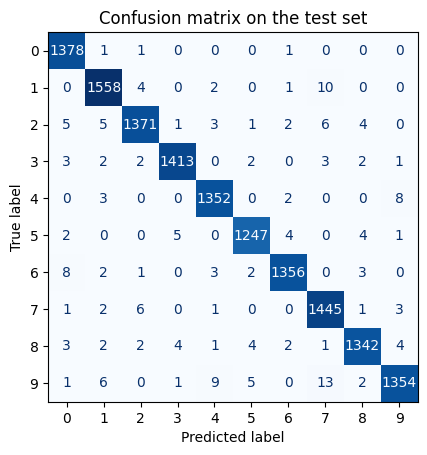
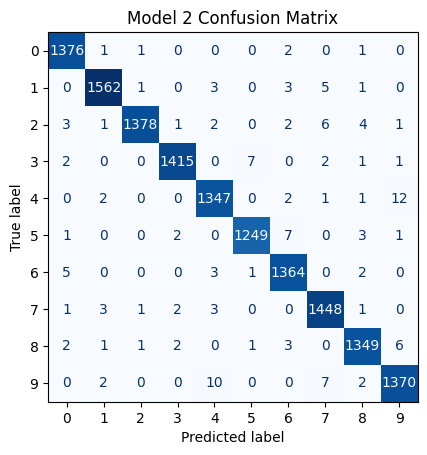

# LEAP-project
**Handwritten Digit Recognition with CNNs in Python (MNIST Dataset)**

The goal of this project was to build and train a Convolutional Neural Network (CNN) to classify handwritten digits from the MNIST dataset. Beyond evaluating overall accuracy, the project focuses on analyzing the model's specific misclassifications using confusion matrices and tests whether deepening the network architecture resolves those targe errors.

## Data Set 
The MNIST data set consists of 70,000 images of handwritten digits, labelled 0 to 9. Each image is 28 pixels by 28 pixels in greyscale.The data was downloaded from OpenML (an open-source machine learning platform) and initially loaded as an array of 70,000 rows, where each row contained 784 numbers representing a flattened image. 

## Model 
### 1. Enviroment Setup
This notebook was developed and tested in Google Colab. The project utilizes NumPy for array manipulation, Matplotlib for visual plotting, and Scikit-learn for dataset preprocessing. The neural network was built and trained using TensorFlow, with Keras configured as the backend.
### 2. Preprocessing
To prepare the inputs for the Convolutional Neural Network, these flat rows were reshaped back into 28x28 grids with a single grayscale channel. Finally, the raw pixel values were scaled from a 0-255 range down to 0-1 to help the network train more efficiently.The data is then split into a training set (80%) and a test set (20%), keeping the class balance. The digits' labels are converted to integers and saved in an array so the model can work with them. 

### 3. Model
The network is built using the Sequential model (straight stack of layers, added in order). 

**Input layer :** Expects an incoming matrix of (28, 28, 1), representing a 28x28 pixel image with a single grayscale color channel. 

**Convolutional layer(Conv2D) :** Applies 32 filters  with a 3x3 window and a ReLU activation function to extract spatial feaures (like edges and curves) from digits.

**Pooling layer(MaxPooling2D) :** Uses a 2x2 window to downsample the feature maps, reducing computational load.

**Dropout layer :** Randomly deactivates 30% of neurons during training to prevent overfitting.

**Flatten layer :** Converts the 2D matrix into a 1D array so it can be passed into the traditional neural network layers.

**Dense hidden layer :** Fully connected layer with 64 units and a ReLU activation function that learns complex patterns.

**Dense output layer :** Fully connected layer with 10 units (one unit per class) using softmax activation function to output the probability for each class.

Once the architecture was defined, the model was compiled using the Adam optimizer, the Sparse Categorical Crossentropy loss function to handle the integer-encoded digit labels, and Accuracy as the primary evaluation metric.

Finally, the model was trained on the training dataset for a maximum of 15 epochs using a batch size of 128, with 10% of the training data set aside as a validation split to monitor performance after each epoch. To prevent overfitting and save computational power, an Early Stopping callback was implemented to monitor the validation loss. If the validation loss failed to improve for 3 consecutive epochs, the training was automatically halted and the model resored the weights from its best-performing epoch.

## Results

### Plots

Looking at the loss and accuracy plots, the blue line represents the training data across each epoch, while the orange line represents the validation data. Because the two curves remain closely aligned and validation accuracy reaches nearly 99%, we can see that the model trained successfully and generalizes well to unseen data without severe overfitting.

**Loss:** Both curves start at a higher value, drop steeply during the first few epochs, and then gradually flatten out as they approach zero. This shows that with each epoch, the model's prediction error decreases and it becomes more confident in its answers.

**Accuracy:** The opposite trend is visible: as the model trains across more epochs, accuracy climbs rapidly at first—jumping from around 91.5% to over 98% within just a few epochs—before leveling off near 99% as the model fine-tunes its predictions.

### Confusion Matrix

Looking at the confussion matrix, it is clear where the mistakes were made and their frequency. The vertical axis indicates the true values and the horizontal axis represents the model's predictions. The diagonal line represents the predictions that correctly matched the true data. 

By examining the off-diagonal cells, we can identify the model's predictive errors. Most notably, the model misclassified the digits 1 (10 instances) and 9 (13 instances) as a 7, likely because the handwritten strokes of these numbers share structural similarities. Of course, these are not the only misclassifications the model made, though other errors occured much less frequently.

## Improving the Model and Comparing

Next, we examined the model's performance after adding a second convolutional layer (this time with 64 filters) and another pooling layer directly after the first convolutional and pooling set. The updated model was compiled and trained using the exact same parameters and configurations as the original, storing the new predictions and results in separate variables for comparison.

It is worth mentioning that during this training run, the model did not reach the maximum of 15 epochs. Due to Early Stopping, training halted early at 8 epochs because the validation loss stopped improving, preventing unnecessary training and overfitting.

### Results and Comparison

The improved model's overall accuracy increased to nearly 99%. 

Looking at the confusion matrix for the improved model (Improved Confusion Matrix, some off-diagonal errors still remain, though the pattern shifted. Specifically, the first model mostly misclassified the digits 1 and 9 as a 7. Adding the extra convolutional and pooling layers reduced the count of mistakes in these cases from 10 to 5 for digit 1, and from 13 to 7 for digit 9. However, this change caused more mistakes between the digits 4 and 9, which the second model confused more frequently. Even though performance improved for one set of digits, it worsened for another.
